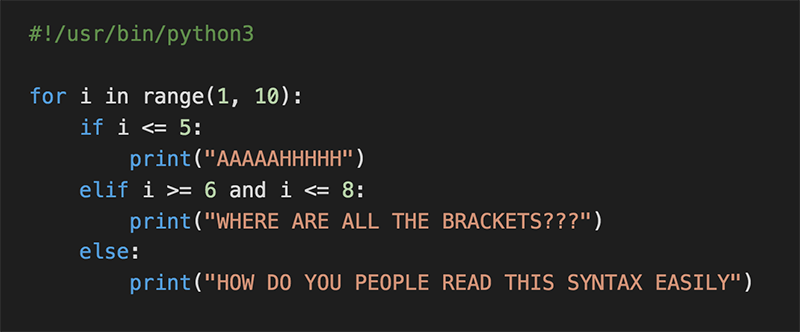

# Welcome to the Python world!

You'll soon find that with Python (and the majority of higher level languages), there are ten different ways to do the same thing. Some tasks will expect only one implementation, while other tasks will have multiple possible implementations.
Python has a linter / style guide, called PEP8, also now known as PyCode. At Holberton, we won't start off with using PyCode, because it's much more strict compared to PEP8. Don't worry if you see a warning when you are running PEP8, you can ignore it.

Enjoy! :+1:

- Guillaume



# Resources
## Read or watch:

### Use this playlist as long as you are learning Python:

- [Learn to Program](https://intranet.hbtn.io/rltoken/n9ts_nUw1YtCR9BZtGrHdQ)

- [Whetting Your Appetite](https://intranet.hbtn.io/rltoken/9w2S6R8vtwlmQcPg33445w)

- [Using the Python Interpreter](https://intranet.hbtn.io/rltoken/O87tA-o6pQ8HXAl93xxGGA)

- [An Informal Introduction to Python](https://intranet.hbtn.io/rltoken/x1m4AhQ1Vy9eUBaXFLRHPQ) (Read up until “3.1.2. Strings” included)

- [How To Use String Formatters in Python 3](https://intranet.hbtn.io/rltoken/dd7bIKsC3_0wb3Np_8URUA)

- [Pycodestyle – Style Guide for Python Code](https://intranet.hbtn.io/rltoken/qHCPZY23PoEBaDVce2P0nw)

# Learning Objectives
At the end of this project, you are expected to be able to explain to anyone, without the help of Google:

## General
How to use the Python interpreter
How to print text and variables using print
How to use strings
What are indexing and slicing in Python
What is the official Python coding style and how to check your code with pycodestyle

# Requirements

## Python Scripts
- Allowed editors: vi, vim, emacs
- All your files will be interpreted/compiled on Ubuntu 20.04 LTS using python3 (version 3.8.*)
- All your files should end with a new line
- The first line of all your files should be exactly #!/usr/bin/python3
- A README.md file at the root of the repo, containing a description of the repository
- A README.md file, at the root of the folder of this project, is mandatory
- Your code should use the pycodestyle (version 2.7.*)
- All your files must be executable
- The length of your files will be tested using wc
# More Info

## Pycodestyle
```Pycodestyle``` is now the [new standard of Python style code](https://intranet.hbtn.io/rltoken/-kju7-n2p8pzvgvgbmAyPw)


# Documentation sur les éléments clés
## Fonction range() :

- Utilisation : range(stop) ou range(start, stop[, step])
- Description : Génère une séquence de nombres. Dans notre exemple, range(100) génère les nombres de 0 à 99 (inclusivement 0 et exclusivement 100).
- Documentation officielle : [Python range()](https://docs.python.org/3/library/functions.html#func-range)
## F-Strings (Chaînes formatées) :

Utilisation : f"{expression}"
- Description : Permet d'inclure des expressions dans des chaînes de caractères en les entourant de crochets {}. Dans notre exemple, ```f"{i:02}"```
formate le nombre i pour avoir toujours deux chiffres ex (02 signifie "deux chiffres, remplis avec des zéros si nécessaire").
- Documentation officielle : [Python F-Strings](https://docs.python.org/3/tutorial/inputoutput.html#formatted-string-literals)
## Méthode str.join() :

- Utilisation : separator.join(iterable)
- Description : Concatène tous les éléments d'un itérable (comme une liste ou un générateur) en une seule chaîne de caractères, avec separator comme séparateur entre chaque élément.
- Dans notre exemple, ```', ' .join(...)``` joint tous les nombres formatés en une seule chaîne, séparés par ```", "```.
- Documentation officielle : [Python str.join()](https://docs.python.org/3/library/stdtypes.html#str.join)
## Fonction print() :

- Utilisation : ```print(*objects, sep=' ', end='\n', file=sys.stdout, flush=False)```
- Description : Affiche les objets passés en arguments dans la sortie standard (par défaut, la console), avec un séparateur sep entre les objets, et termine avec end (par défaut, une nouvelle ligne). Dans notre cas, nous avons utilisé print pour afficher une chaîne formatée.
- Documentation officielle : [Python print()](https://docs.python.org/3/library/functions.html#print)
# Concepts Utilisés
## Boucles for en Python :

- Permettent d'itérer sur une séquence (comme une liste ou une plage de nombres).
Dans notre code, ```for i in range(100)``` parcourt chaque nombre de 0 à 99.
- [Documentation Python sur les Boucles](https://docs.python.org/3/tutorial/controlflow.html#for-statements)
## Compréhensions de Générateur :

- Syntaxe compacte pour générer des éléments à la volée.
Exemple : ```(f"{i:02}"``` ```for i in range(100))``` génère une suite de chaînes formatées.
- [Documentation sur les Compréhensions](https://docs.python.org/3/tutorial/datastructures.html#list-comprehensions)
- Documentation Additionnelle
- Pour une compréhension approfondie de Python, vous pouvez explorer les ressources suivantes :

# Documentation Python Officielle : [docs.python.org](https://docs.python.org/3/)
- Tutoriel Python : [Python Tutorial](https://docs.python.org/3/tutorial/)
- Pépites sur Python : Python Tips

